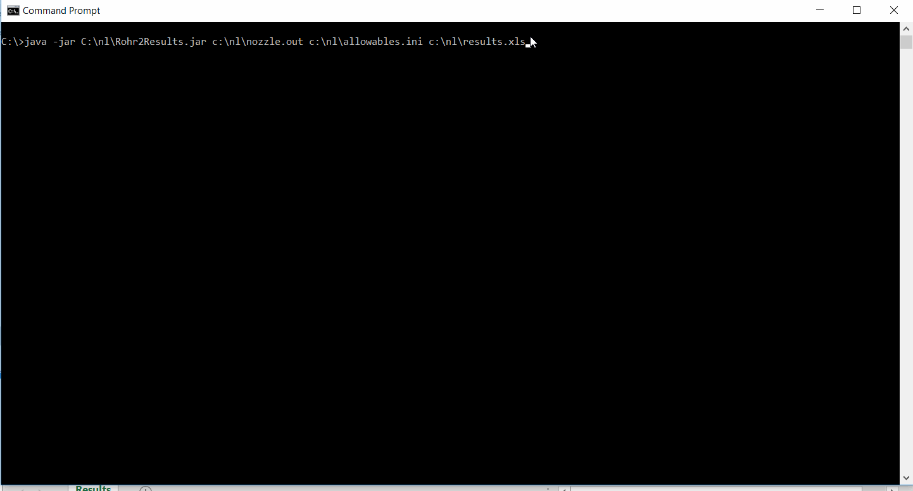

# Rohr2 Nozzle Allowable Checker

## Objective
+ Reads in [Rohr2](https://www.rohr2.com/) software nozzle.out results file.

+ Checks the nozzle loads against the user defined allowable forces and moments captured in the allowables.ini file.

	+ 3 types of allowables can be defined:
		+ Resultant - 1 component
		+ AxRad - 1 axial and 1 radial component
		+ Component - 3 components

+ Results are written to *.xls file highlighting utilization above 100%

## Quick use
+ The runnable ***.jar**, a sample **nozzle.out** and the editable **allowables.ini** file can be found here: [ ! start here - sample data and instructions](https://github.com/szivalaszlo/Rohr2-Nozzle-Allowable-Checker/tree/master/!%20start%20here%20-%20sample%20data%20and%20instructions)

+ Open allowables.ini for detailed instructions and for defining the allowable loads

+ The program needs 3 arguments to start
	+ nozzle.out Rohr2 output file path
	+ allowables.ini initialisation file path
	+ results.xls output file  path

+ **Example command**:
	+ java -jar C:\Rohr2Results.jar argument1 argument2 argument3
	+ java -jar C:\Rohr2Results.jar c:\nozzle.out c:\allowables.ini c:\results.xls

